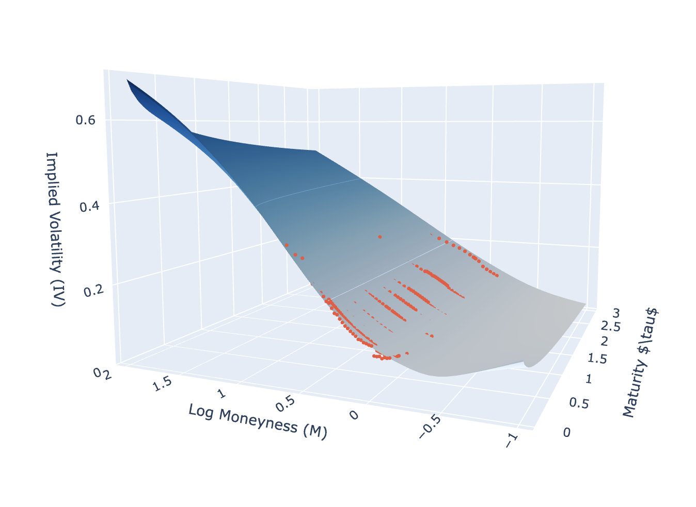

## Master Thesis Repository 

- Volatility focasting of stock return through IV.
- Focusing on firms in energy sector.
- Leverage the ESG news indicators to improve the focasting accuracy.
- Application to build trading strategy, risk management, hedgeing. 

  

  <em>Fitted implied volatility surface for S&P 500 index option </em>

